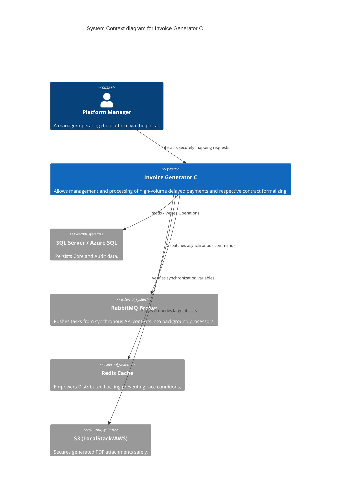

# Architecture Overview

**Invoice Generator C** embraces a strict adherence toward **Clean Architecture** patterns distributed globally alongside modular structures spanning the frontend capabilities. Functionally constructed around Cloud-Native foundations, it heavily utilizes decoupled asynchronous jobs.

## System Macro C4 Model (Context)

## Backend Dissection (.NET 8)

The backend structure acts precisely segregated, decoupling infrastructure logic out from raw business implementations.

- **API Layer**: Exposes precise REST endpoints while configuring fundamental start mechanisms (`Program.cs`). Includes critical traffic guards like `RouteProtectionMiddleware` and logging traps like `AuditLogMiddleware`.
- **Application Layer**: Logic entirely governed utilizing the traditional CQRS pattern via `MediatR`. It detaches Command pipelines from simple View Queries resulting in pure decoupling.
- **Domain Layer**: Essential logic fragments, standalone Entities devoid of entity-framework relationships, and definitions for base interface abstractions (e.g. Repositories).
- **Infrastructure Layer**: Encompasses practical implementations, database context via Repositories using `EF Core`, caching connectors, Queue definitions using `MassTransit` with RabbitMQ, and blob storage definitions hooking AWS via LocalStack.

### Indispensable Core Patterns
- **Distributed Locking Mechanism:** Employs the `RedisDistributedLock` to guarantee complete atomicity when sealing agreements. Prevents twin endpoints fired concurrently over one contract from generating duplicated Billet outcomes.
- **Strategy Pattern Routing:** Handled via `InvoiceGeneratorCDebtCalculationStrategy`, supplying versatile parameters indicating exactly how distinct calculations react matching different portfolios.
- **Event-Driven Architecture (EDA):** Leverages the RabbitMQ ecosystem triggering items such as `AgreementFormalizedEvent` toward decoupled micro-consumers independently.

## Frontend Assembly (Angular 17)

The frontend aligns strongly presenting stellar UI/UX oriented toward enterprise workflows:
- **Core / Shared Modules**: Embraces global HTTP token interceptors matching strict Authentication loops directly against API bounds. Holds the majority of generic UI items.
- **Delineated Feature Zones**: Splits domains securely into sub-modules (such as `admin` mapping exclusively log tables vs `dashboard` rendering portfolio collections alongside IFrame Billet visualizations).
- **Material Design Fidelity**: Pushes Angular Material items (snackbars, responsive nested tables, dialog popups) completely synchronized to the 100%-covered **Dark Mode** toggle logic built inside `styles.scss`.

## API -> Frontend Passthrough Bridge

Security constraints binding UI interactions with Backend engines rely fundamentally across these two tenets:
- **Nginx Reverse Proxy Logic**: Sandwiches connections through `Port 80`, pushing standard static routes onto Angular distributions while selectively repassing `/api/` calls explicitly towards the internal underlying Backend container context.
- **HttpOnly Secure Tokens**: Ensures Authentication JWT configurations flow across sealed HttpOnly structures, severely limiting the attack vectors for severe Cross-Site Scripting (XSS).
