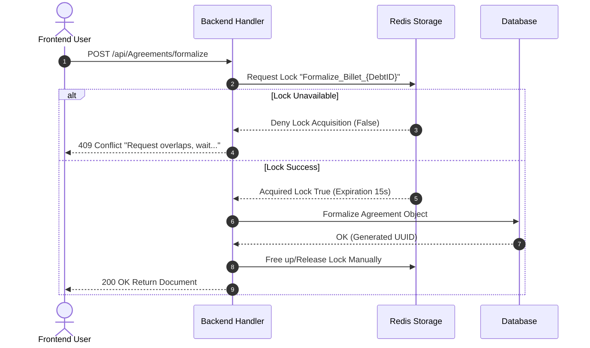

# Business Rules and Algorithms

The core value of **Invoice Generator C** resides in its flawless debt management calculation and how it handles strict financial rules when agreements are being generated and accepted.

## 1. Debt Strategy Methodology

When visualising a portfolio of debts natively known within the system as `Contracts`, the entire amount is pushed via a Strategy context (`InvoiceGeneratorCDebtCalculationStrategy`).

**Mathematical Core Algorithm**:
- **Gross Principal:** Directly pulled from the underlying debt.
- **Default Penalty Rules:** A fixed parameterized rate or an adaptive fine is applied across the base principle depending on variables.

> [!TIP]
> This dynamic pattern enables scaling up different variants of tax calculations effortlessly simply by appending an alternative strategy concrete class without interfering with existing dependencies.

## 2. Distributed Locking Workflow

Dealing with debts involves an extreme requirement avoiding multi-clicks from a frustrated frontend user rendering multiple different Billets against a single exact debt balance.

This is securely safeguarded via `RedisDistributedLock`.
The algorithm follows this sequence deeply:

## 3. Emitting Documents (QuestPDF & S3)

The generation is detached and secure.
1. The validated debt object data runs against `QuestPDF` elements generating pixel-perfect `.pdf` variants of standard Boletos natively inside the C# bounds avoiding external bloated rendering hooks.
2. The payload is not leaked across responses under base64 shapes, it natively flows upstream onto LocalStack S3 returning only the object presigned route back avoiding enormous payloads jamming JSON serialization.

## 4. Robust Authorization Mechanisms

All actions adhere comprehensively towards `RouteProtectionMiddleware`. Extensional mechanisms block accesses actively validating Tenant properties bounding data horizontally guaranteeing exclusivity. Furthermore, any failure traces its explicit footprint deeply into the internal Audit Pipeline hiding precise coordinates using AES-256 for anonymizing incoming IPs while maintaining analytic clarity tracing down specific events precisely across endpoints and queries.
