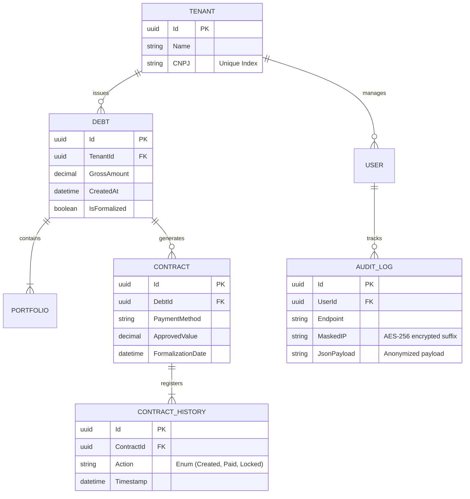

# Database Schema and Relationships

**Invoice Generator C** handles rigorous financial entity relationships ensuring traceability. Built atop `Entity Framework Core`, the database enforces strict navigational properties.

## Relational Entity-Resource Diagram

## Entity Framework Behavior

- **Lazy Loading is Disabled**: To prevent N+1 connection storms, EF Core strictly mandates `.Include()` query structures when hydrating parent-child contexts (e.g., pulling `Contract` and fetching its appended `ContractHistory` nodes).
- **Audit Interceptors**: EF Core Interceptors inject implicit fields like `CreatedAt` and `UpdatedAt` right before committing changes onto the execution pipeline. 
- **Soft Deletions**: Financial records are never truly purged (`DELETE FROM`). Operations toggle an internal structural `IsActive` or `DeletedAt` timestamp, rendering records oblivious to typical queries unless explicitly searched through Admin panels.
