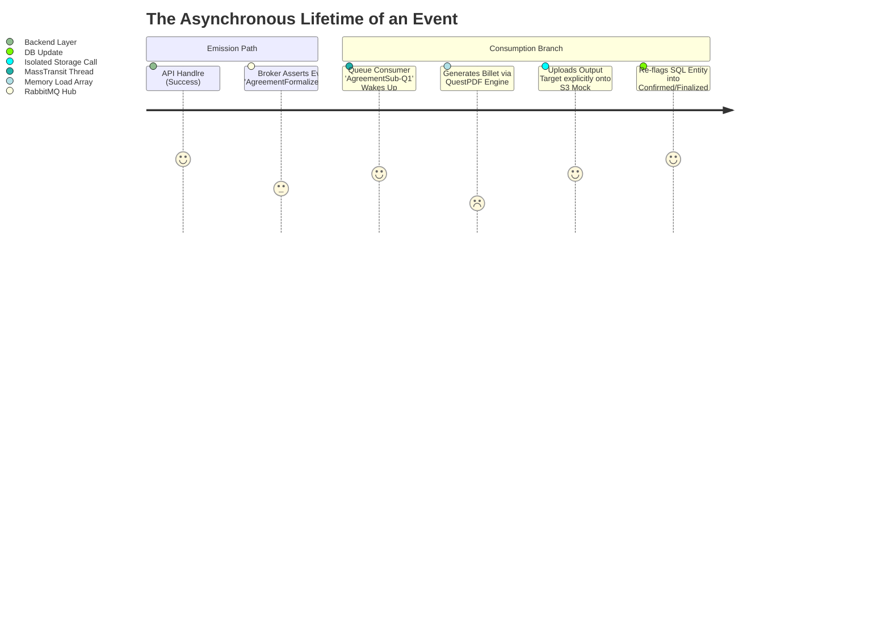

# Queue Operations & Messaging

Background decoupling heavily isolates bottlenecks within **Invoice Generator C**. A system reliant purely on synchronous HTTP loops crashes easily anticipating intensive document rendering.

## 1. Engine Infrastructure (RabbitMQ & MassTransit)

We combine `RabbitMQ` alongside the extreme versatility of the `MassTransit` libraries wrapping the configuration abstractions natively avoiding tedious boilerplate loops.

- **Publisher Extractor**: When `Agreements/formalize` hits its endpoint and bypasses Redis Lock constraints, its main purpose concludes immediately dropping a structured JSON event payload blindly towards the RabbitMQ broker before pushing HTTP `200 OK`. No synchronous delays wait rendering limits.

## 2. Event Ecosystem Workflow

The standard event topology is built surrounding highly descriptive naming schemas representing the core state changing.

## 3. Resilience and Dead-Letter Pipelines

Network spikes or abrupt restarts over DB connections throw catastrophic warnings. Handlers wrapped behind MassTransit inherently invoke structured **retry mechanics**.
- If a consumer trips parsing exceptions over an event consecutively `X` configured times, `MassTransit` halts loops unconditionally detaching the poisoned payload safely away tossing its schema inside native `_skipped` or `_error` Dead-Letter designated exchange queues holding manual replay capacities later avoiding blockage clashing active queues universally.
