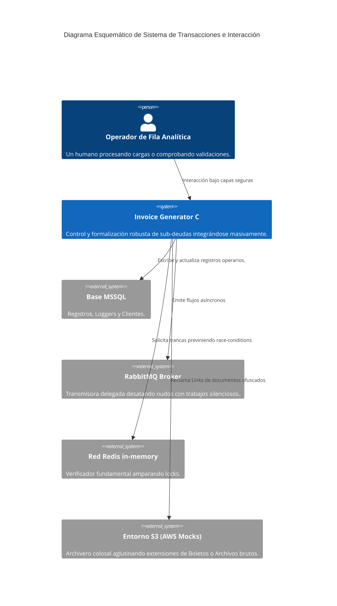

# Visión General de la Arquitectura

**Invoice Generator C** asume estricta fidelidad en la ejecución metódica para sus patrones orientados por los pilares fundamentales definidos mediante características **Clean Architecture** junto a un front-end extremadamente aséptico y desacoplado modularmente. Al encontrarse configurado fuertemente hacia la Nube Cloud-Native confía a fondo en las delegaciones diferidas y procesamiento interdependiente constante.

## Análisis Estructural Topológico C4 (Sistema)

## Estructura Central Oculta (.NET 8)

El corazón ha recibido total fraccionamiento de lógicas abstractas evitando dependencias erráticas directas en sus infraestructuras expuestas:

- **API Layer**: Exposición REST para conectores y validación masiva alojada orgánicamente en `Program.cs`. Engloba las protecciones como escudos (`RouteProtectionMiddleware`) sumado a los atrapa logs integrales (`AuditLogMiddleware`).
- **Application Layer**: Área que respeta el modelo **CQRS**, articulando rutinas extensas (con `MediatR`), apartando totalmente la inyección de Comandos alteradores frente a Peticiones benignas del visor local.
- **Domain Layer**: Capa magna que anida Entidades crudas y definiciones primigenias desatadas por cualquier herramienta posterior (`EF`), además de pactar las Interfaces fundamentales atadas a reglas inquebrantables de base de datos o lógica pura.
- **Infrastructure Layer**: Envuelve en manto de códigos operativos sus librerías más externas: con `EF Core` rigiendo esquemas, mapeo cache, colas expuestas y con `MassTransit` comandando RMQ paralelo al manejo robusto de inyecciones AWS en simulacros del _LocalStack_.

### Modelos y Cimientos Intransferibles
- **Mecanismos Distributed Locking:** Efectúa controles absolutos gracias a su variante `RedisDistributedLock`. Garantiza exclusión de condiciones donde ráfagas simultáneas pidan emitir o generar copias indebidas derivadas tras múltiples acciones provenientes de la UI hacia el documento madre de acuerdo.
- **Enrutamiento Strategy Pattern:** Delegado con firmeza alrededor del componente `InvoiceGeneratorCDebtCalculationStrategy` modela variabilidad ilimitada ante lógicas complejas determinando costes sin afectar rutinas consolidadas previas en su código.
- **Event-Driven Architecture (EDA):** Aborda resoluciones delegadas de amplia demanda al impulsar elementos informativos (un buen ejemplo recae bajo el identificador `AgreementFormalizedEvent`) mediante RabbitMQ absorbiéndolos o liberando hilos reactivos instantáneos.

## Interfaz Encomendada Frontend (Angular 17)

Enfocado intensamente en moldear vivencias de trabajo robustas del lado B2B o utilidades corporativas:
- **Core / Shared Modules**: Guarda bajo sus bóvedas al interceptor primordial HTTP, conectando loops autorizados o JWT puros en conjunción con plantillas básicas sin repetir lógicas UI por módulos adyacentes.
- **Delineamiento y Feature Zones**: Ramifica los segmentos con extremada seguridad protegiendo el acceso o su despegue, blindando el modulo operacional con registros globales puramente desde `admin` y volcando en subsegmentaciones del lado client para `dashboard` (para visores de boletos vía sandboxing riguroso).
- **Consagración al Material Design**: Engrana tablas intrincadas nativamente provistas, y un sistema rotativo ineludible ajustándose magistralmente al **Modo Oscuro**, dictaminando cambios en escalas de color e infografías integradas.

## Puente Rígido Proxificado API -> Frontend

Ata e inmuniza todas la plataforma con una de las uniones más resilientes implementadas en su core:
- **Lógica e Interceptación de Nginx Reverse Proxy**: Fungiéndose nativamente emparedando los envíos directos, reparte y propaga a usuarios la red frontal por el predeterminado Puerto 80 distribuyendo eficientemente sus _builds_. Mientras simultáneamente todo aquel mandato dirigido por el patrón de barra `/api/` fluye oculto redireccionado velozmente hacia las profundidades resguardadas dictadas a contadores .Net.
- **Criptografía Extendida en Sesiones HttpOnly**: Ancla la experiencia con firmezas previas forzadas encriptando credenciales vitales y JWT mediante envoltorios `HttpOnly`, mutilando inmediatamente avenidas indeseables ligadas a inserciones externas directas y secuestros crudos (ataques clásicos delineados por base Cross-Site Scripting).
