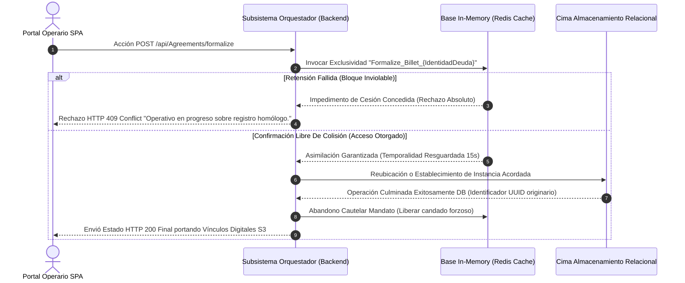

# Estructura Analítica de Reglas de Negocio

El atributo principal inquebrantable de **Invoice Generator C** gravita vigorosamente en su capacidad para modelar con rigurosidad matemática pautas operacionales durante la emisión o asimilación de adeudos y cobros regulados interempresas.

## 1. Algoritmia Estricta: Método Strategy 

Cando un administrador lanza consultas amplias abarcando deudas ramificadas (designadas globalmente del lado de servidor como entidades `Contracts`), cada uno de los importes crudos traspasa el núcleo calculador gobernado firmemente por un subentorno aislado definido bajo el nombre `InvoiceGeneratorCDebtCalculationStrategy`.

**Motor Matemático y Sub-reglas**:
- **Asimilación Principal:** Reflejo integral derivado de la deuda madre o montos base expuestos al sistema sin edulcorantes.
- **Multas y Sanciones Reactivas:** Parametrización fluida permitiendo adherir porcientos tarifarios o cargos consolidados ante transgresiones u omisiones contractuales de manera versátil dependiendo explícitamente del contrato y época consultada.

> [!TIP]
> Mantener adherido el patrón de diseño "Strategy" otorga plenas libertades posteriores al permitir ramificar variantes y extender calculadoras numéricas totalmente radicalizadas anexadas tras interfaces, en vez de alterar destructivamente métodos originarios madurados en el código fuente del ecosistema productivo.

## 2. Mecánica Distribuida sobre Bloqueos Exclusivos (Distributed Lock)

Burlar embotellamientos ocasionados al reincidir inescrupulosamente ejecuciones masificadas duplicadas lanzadas contra end-points generadores (ej. clicks de botón precipitados) demanda contenciones arquitectónicas agresivas orientadas para jamás devolver boletas incongruentes y mellizas.

Este flanco invencible le pertenece intrínsecamente a dictámenes impuestos por la barrera del `RedisDistributedLock`.
Aquí su disección metodológica explicada a nivel flujo lógico temporal:

## 3. Consolidación Vectorizada (QuestPDF y Redes S3) 

Fungiendo responsabilidades vitales al término del ensamble de los cobros en formatos aceptados se separan lógicas pesadas esquivando deficiencias de consumo al servidor.
1. Modelos ya dictaminados tras validaciones duras traspasan confines orientados haca mallas visuales vectorizadas nativas dentro de esquemas configurados puramente de la mano productiva entregada vía la potente librería `QuestPDF` conformando las plantillas de visualización en puras extensiones pre establecidas `.pdf`.
2. Estas formaciones volumétricamente inestables resultan repelidas a cruzar los límites HTTP puros por esquemas Base64 pesados que congestionan respuestas inmediatas enviándolos sin dudar a resguardos colosales bajo S3 (emulados temporalmente como contornos LocalStack); despachando minúsculas referencias pre-validadas a modo URL devolviendo flujos óptimos y ligeros hacia peticiones asíncronas originarias de front-ends livianos.

## 4. Cerrazón Exclusiva y Huellas Auditables (RBAC Plus)

Toda la pasarela atada frente a la visibilidad y mandatos recibe asediados análisis tras murallas provistas minuciosamente guiadas ante `RouteProtectionMiddleware`. Elementos enteros recaen subyugados acatando pautas determinantes delimitadas vía aislamientos Tenant asegurándose intercepción directa anulativa y exclusión radical apenas divisado intrusos intentando fisurar interbloqueos cruzados entre contratos no adyacentes a loggers legítimos. Errores mortales rastrean y anidan pistas seguras perennemente entregando marcas irrefutables en repositorios ciegos auditables asfixiando enmascarados indeseables, desvirtuando finales IPs tras ciframientos pseudo-anónimos dictados ante estándares cifrados AES-256 mitigando revelaciones crudas legales y potenciando historiales perfectos evaluativos y precisos perimetralmente sobre consumos expuestos en la red integral de endpoints.
