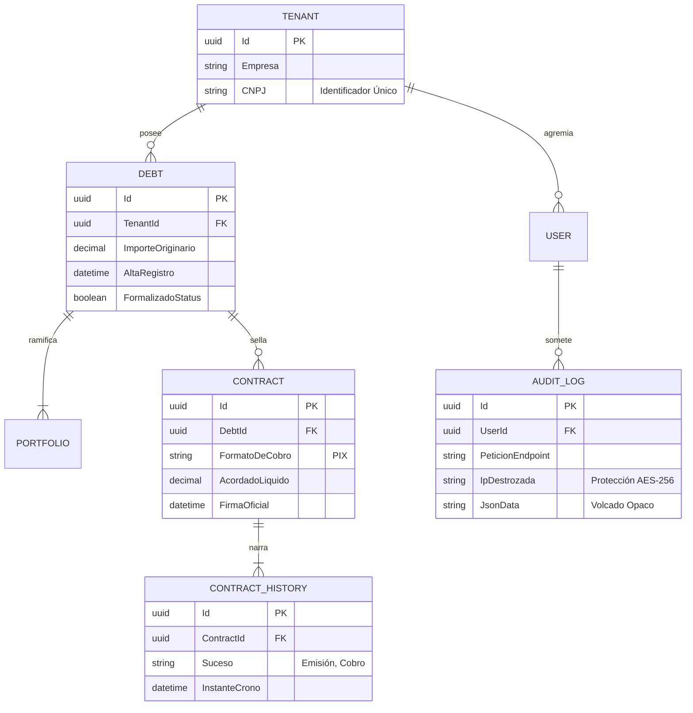

# Esquemas Relacionales de Tablas y Base de Datos

**Invoice Generator C** modela cimientos inquebrantables garantizando historial irrefutable. Edificada lógicamente arriba del motor de `Entity Framework Core`, blinda y dicta comportamientos de dependencias entre cada tabla.

## Diagrama Entidad-Relación (Relacional)

## Estrictos Dictámenes de Comportamiento EF Core

- **Restricción y Abolición del Lazy Loading (Cargas Diferidas)**: Amputada por defecto en favor preventivo ante ataques desmesurados a la red conocidos por desastres N+1 Query. Llama y demanda uniones limpias utilizando la variante cruda de mandatos `.Include()`.
- **Rastros mediante EF Interceptors**: Contadores de tiempo inyectan sobre la raíz del context antes de cada volcado (Save) sus respectivas firmas de actualización cronológica asilando al sistema dependiente manual.
- **Borradores Invisibles (Soft-Deletes)**: Una regla vital es denegar terminantemente ejecuciones absolutas `DELETE FROM`. Alterando un campo sombra vital, la fila asume exclusión aparente escondiendo sus datos solo de la vista al cliente normal pero preservándola para auditorías.
