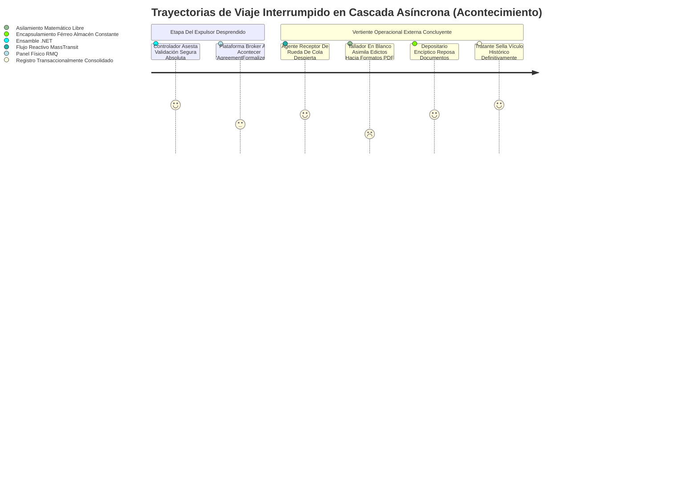

# Escalamiento Asincrónico mediante Mallas Mensajeras (Queues)

Una barrera insalvable para frenos absolutos frente colas crónicas de petitorios paralelos se logró atajando desacoples asíncronos radicales protegiendo eficientemente a nuestra base llamada **Invoice Generator C**. Aquel entramado estático atrapado incesantemente procesando tiempos prolongados devolviendo repuestas bajo asfixiadas llamadas crudas HTTP morirá y fallará agónicamente ante altas demandas en procesamiento volumétrico transaccional o documentario.

## 1. El Latido Abierto Desacoplado (RabbitMQ engrasado bajo MassTransit)

Ensamblamos vínculos fortificando cimientos atando los conductos `RabbitMQ` recubiertos con innegable fineza instrumental inyectando `MassTransit`. Decretando una nulidad rotunda a establecer enlaces brutos consumiendo ciclos interminables crudos evitando fugas infinitas por la persistencia e intervenciones sobre conductos y flujos puros.

- **Eyector Pícaro e Instintivo (Event Publisher)**: Una vez los dominios englobados tras barreras Redis se vencen permitiendo formalizaciones limpias en `Agreements/formalize`, todo trabajo síncrono agotador y complejo detiene su participación, delegando cargas estructuradas ciegas atadas en cargas al transportador puro. Un estado inmediato de soltura HTTP devuelve confortantemente visiones operacionales liberadas bajo repuesta 200 librando al CPU de colapsar la memoria principal rindiendo documentos o llamadas en base. 

## 2. Mapa Interactivo Sublevante (Workflow de Disparos)

Los mensajes abrazan arquitecturas definidas con vocería clara representando tránsitos del comportamiento transformado dictados rigurosos en lenguajes simples y concretos indicando fin de tareas pasadas.

## 3. Barreras Defensivas Auto-Reparables y Repositorios Nulos

Los golpes abruptos o cataclismos originados en tiempos ciegos por la sub-capa red de Bases o S3 ocasionan catástrofes mortales para rutinas transaccionales paralelas en crudo. Aquellos agentes oídos adosados inmersamente incrustados cobrando beneficios orgánicos envueltos atreves del ecosistema puro provisto generosamente derivado del sistema reactivo _MassTransit_ adoptan mecánicas auto-recuperables blindadas bajo estrategias probadas por _Reintentos Pasivos Controlados_ retardados exponencialmente (Retries).
- Al verse atascado orgánicamente aquel recibidor, estrellándose destructiva y consecutivamente asediado a causa de componentes nulos caídos en formatos irreconocibles topando un umbral preestablecido estricto `X` reiteradas re-lanzadas. El guardián supremo interfiere atenuar caos infinitos y encadena férreo aísla perimetralmente asilando al evento mortal desterrado, acunándolo silenciado hacia contenedores muertos denominados apartadamente "_Colas Sepulcros o Dead Letters_" posibilitando así redimirlos en futuros ensayos humanos reparados sin obstruir ni taponar los tubos transitorios maestros operacionales de otros eventos puros funcionales sanos circulando de fondo.
