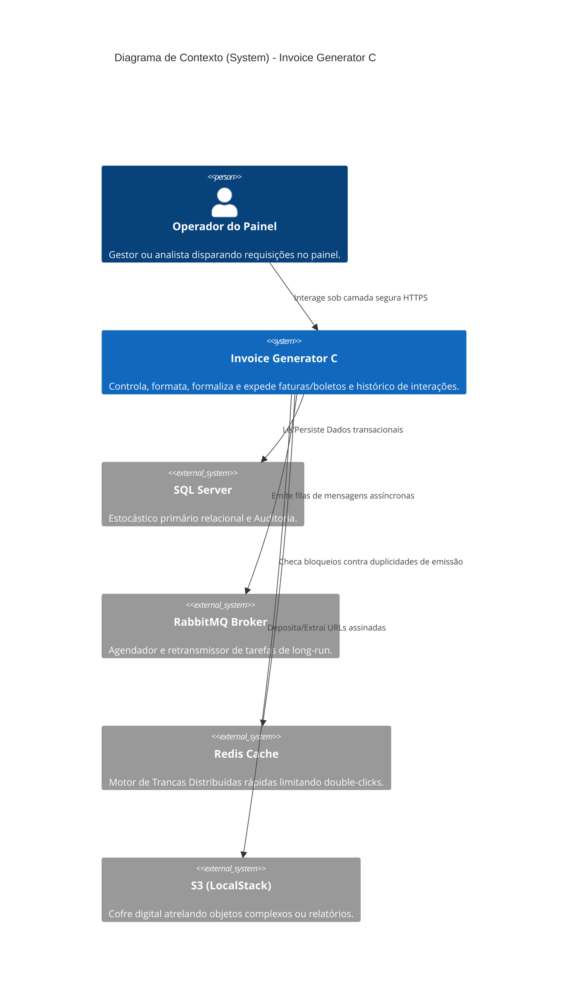

# Visão Geral da Arquitetura

**Invoice Generator C** abraça e segue religiosamente o desenho tático de **Clean Architecture** na sua fundação transeunte e em sua face exposta ao utilizador. A base da plataforma tem como alvo principal a excelência e robustez assíncrona, categorizando-se como puro *Cloud-Native*.

## Modelo Macro Sistêmico C4 (Contexto)

## Dissecando o Backend (.NET 8)

O modelo central estrutura separadamente sua capacidade computacional em camadas agnósticas.

- **API Layer**: Posição exposta orientando as diretrizes de conexão REST com o script fundacional no `Program.cs`. É onde ficam escudos protetores críticos vitais como o `RouteProtectionMiddleware` e extratores massivos via `AuditLogMiddleware`.
- **Application Layer**: Inteira espinha dorsal lógica estruturada sobre os ombros do **CQRS** (pelo `MediatR`). Impede que uma Query complexa de leitura afete arquitetonicamente um Command de escrita do banco.
- **Domain Layer**: Entidades cruas, livres de vícios atrelados ao Entity-Framework. É aqui que moram os esqueletos de Interfaces cruciais apontando para os repositórios.
- **Infrastructure Layer**: Envelopagem prática de ações: o `EF Core` definindo as amarras dos bancos, instâncias configuradas conectando serviços externos como fila provinda do RabbitMQ ou nuvens de blob do S3.

### Padrões Intrinsecamente Adotados
- **Distributed Locking Mechanism:** Utiliza ativamente sua peça fundamental `RedisDistributedLock` assegurando transações blindadas de bloqueio atômico. Interrompe requisições adjacentes emitindos choques de duplicação quando se tenta emitir mais de uma subscrição por documento num ínterim perigoso.
- **Strategy Pattern Routing:** A ramificação inteligente controlada via `InvoiceGeneratorCDebtCalculationStrategy`. Ele molda os custos dos parcelamentos injetando matrizes precisas perfeitamente variadas perante cada cenário requisitado da API.
- **Event-Driven Architecture (EDA):** Tira vasto benefício soltando instâncias reacionais como `AgreementFormalizedEvent` para o ar através das alhetas do RabbitMQ, consumindo de forma não-bloqueante a posterior consolidação.

## Componentização Frontend (Angular 17)

Um visual totalmente preparado para engajamentos robustos em corporações escaladas:
- **Módulos Core / Shared**: Encapsula esferas essenciais (como *interceptors HTTP*) alinhando cada ponta criptografada originada para o backend por JWT. Fornece ferramentas modulares reutilizadas.
- **Áreas Feature Separadas**: Isola as páginas dividindo as obrigações para `admin` apenas no gerenciamento das tabelas internas ou subentidades operacionais e para o `dashboard` na carga efetiva perante boletos interligando exibições _sandboxed_.
- **Fidelização ao Material Design**: Fibras profundas atreladas as tabelas estendidas com hierarquias abertas do Angular Material, popups engajados nativos que suportam 100% inversão imediata de temas via CSS no **Dark Mode**.

## A Ponte Esculpidas API -> Frontend

Padrões definitivos blindados por esses preceitos básicos englobam a camada:
- **Nginx Reverse Proxy Logic**: Atua disfarçando as portas diretas rodando pelo `Port 80`, varrendo as aberturas do SPA e roteando assertivamente tudo aquilo engatilhado em caminhos iniciados por `/api/` para os confins invisiveís da infra dotNet central.
- **Segurança HttpOnly**: Garantia máxima ao empurrar tramas decodificadas de autenticação em formato *Cookies HttpOnly*, bloqueando assim que eventuais *Cross-Site Scripting (XSS)* perigosos invadam ou subtraiam autorizações abertas globalmente por via frontend Javascript.
