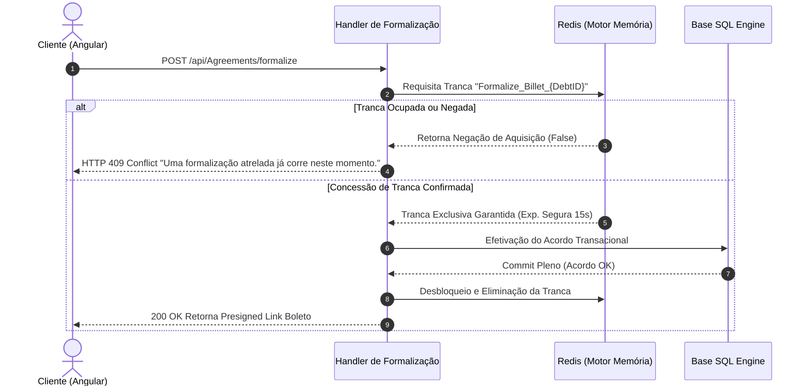

# Regras de Negócio e Algoritmos Puros

O genuíno valor fundacional do **Invoice Generator C** apoia-se firmemente em como a plataforma dita, reage e consolida gestões perante regulamentações de formalização altamente rígidas associadas a pagamentos.

## 1. Estratégia de Cálculo Transmissível (Strategy Pattern)

Ao solicitar visualizações de agregados ou sub-dívidas amarradas sob domínios ditos como `Contracts`, este montante sofre recalibração impulsionada contextualmente ativando invariavelmente a classe estrita de cálculo: `InvoiceGeneratorCDebtCalculationStrategy`.

**Mecânica Matemática da Subclasse Padrão**:
- **Tratamento do Principal Bruto:** Obtido de maneira relacional direta da dívida bruta matriz.
- **Parametrização Taxativa (Fines/Juros):** Taxas reativas e multas fixas atreladas às quebras de acordos que adaptam-se fluente às varáveis e temporalidade do devedor.

> [!TIP]
> A engenharia deste design Pattern confere ao desenvolvedor poderes de anexar lógicas radicalmente divergentes sobre novos clientes estendendo novas interfaces da Strategy e nunca reescrevendo código central consolidado.

## 2. A Trava Central: Distributed Locking Workflow

Assinar lides dívidas expostas num frontend pode acarretar engarrafamentos perigosos (ex. picos massivos ou "double-clicks" de estresse originados de conexões fracas) despachando várias petições de formalizações paralelas. Consequentemente se geraria boletos bizarramente clonados para um boleto final idêntico. 

O escudo impenetrável contra tais fatalidades obedece aos laços do `RedisDistributedLock`.
Eis o mapa seqüêncial estrito delineado em tempo de ação:

## 3. Motorização De Documentos (QuestPDF & Cloud S3 Local)

O renderizador base das folhas obedece ao isolamento performático de infra blidando todo trajeto sensível do boleto gerado.
1. Quando validadas, as rotas repassam seus objetos de acordo abertos paras raízes do `QuestPDF` estruturando milimetricamente dezenas vetoriais num papel digital `.pdf` perfeito dentro das trincheiras nativas limpas de dependências HTMLs instáveis.
2. Esta massa brutal binária escapa do perigo atroz do envio em String base64 na resposta final ao utilizador e salta magicamente amarrações na S3 (LocalStack mockado nos fluxos de testes), regressando unicamente sua identidade rastreável de URL segura finalizando de praxe sem entupir serializações pesadas e doloridas aos servidores.

## 4. Raízes Firmes em Auditoria (RBAC Plus)

As diretivas respondem ao mandato fechado ditado atenciosamente através da interceptação cega pelo `RouteProtectionMiddleware`. Entidades e fluxogramas inteiros baseiam as regras bloqueantes ou abertas por validações cegas orientadas sobre subestruturas de isolamento lógico Tenant onde cruzamento indevido de requisições cai duramente rechaçado instantaneamente. Ocorrências fatais rastreiam assinaturas na raiz nativa repassando aos Registradores do Audit de maneira pseudo-mascarada dissimulando os últimos octetos de IP dos agressores via máscaras AES-256 e assim retendo precisão integral na identificação dos eventos para análises tardias.
