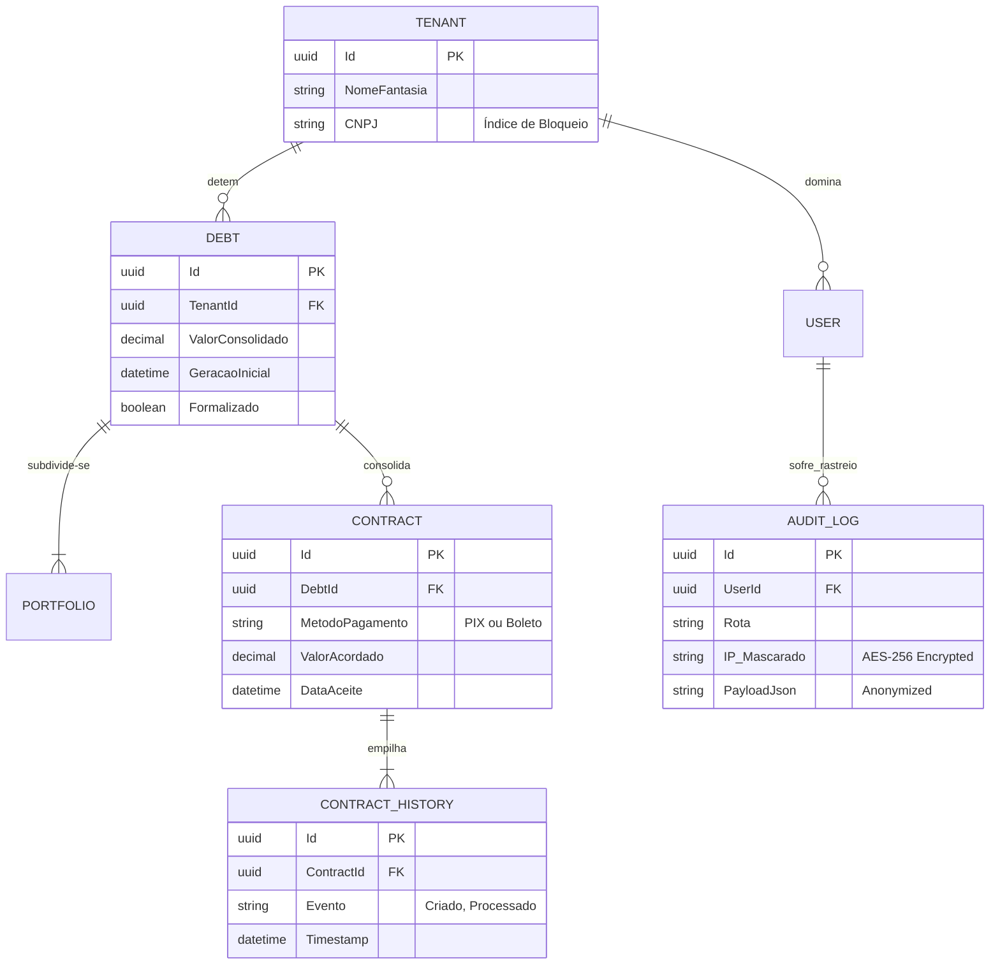

# Esquema de Banco de Dados e Modelagem Entidade-Relacionamento

O **Invoice Generator C** acopla-se a pilares financeiros estritos que impedem extravio de relacionamentos e garantem rastreabilidade perpétua através do poder logado via `Entity Framework Core`.

## Diagrama Entidade-Relacionamento (ERD)

## Comportamento Acoplado no Entity Framework

- **Abolição do Lazy Loading**: Para estrangular de imediato falhas performáticas letais (O problema de N+1), a carga de entidades filhas ou avós exige o verbo manual `.Include()` e evita cascatas SQL invisíveis indesejáveis.
- **SaveInterceptors Naturais**: A plataforma anexa interceptadores EF Core garantindo que qualquer salvamento injete carimbos atômicos imperceptíveis no `CreatedAt` sem nenhuma ação paralela dos controllers centrais.
- **Extinção Lógica (Soft Delete)**: Por força-tarefa de conformidade, dívidas e faturas jamais presenciam comandos `DELETE`. O sistema impõe _arquivamento lógico_ alterando booleanos vitais como `IsActive = false`, resguardando-as eternamente acessíveis via auditoria temporal.
