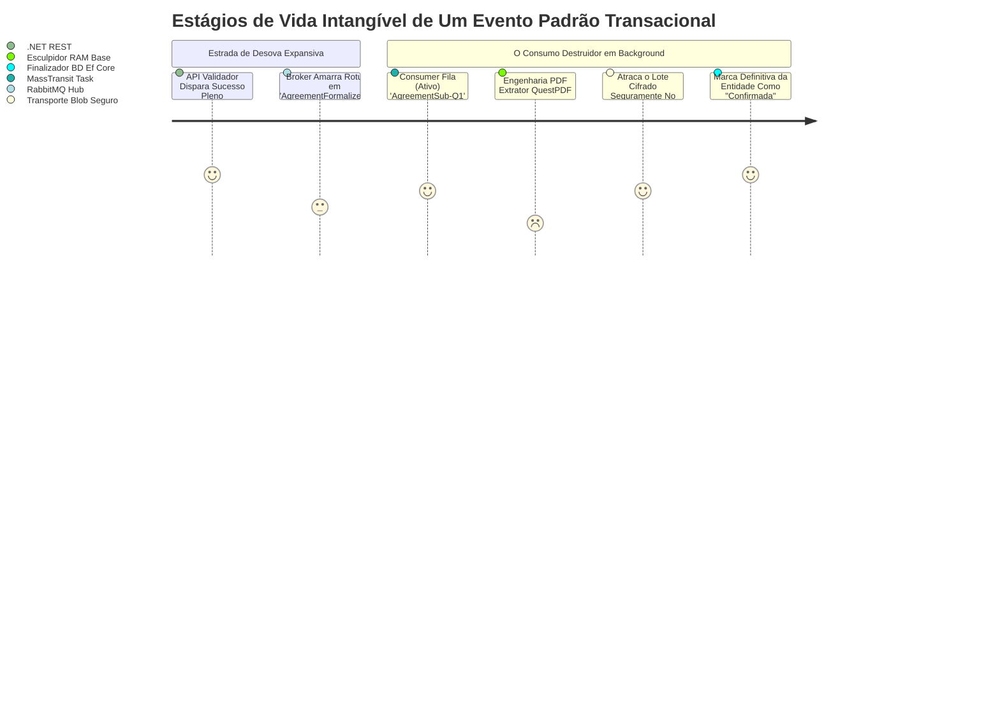

# Gerenciamento de Filas e Escalonamento de Mensagens

O desacoplamento vital executado em plano de fundo extingue engarrafamentos críticos e crônicos nas fundações do **Invoice Generator C**. Um sistema aprisionado vivendo por laços transacionais esperando respostas demoradas no contexto do cliente em HTTP costuma fenecer em sobrecargas trágicas.

## 1. Core de Operação Massiva (RabbitMQ associado MassTransit)

O enlace une forças colossais perante `RabbitMQ` (Broker Base) sob as engrenagens finas modulares abertas estipuladas através das ramificações `MassTransit`. Livra-nos exaustivamente confecções manuais entediantes gerando loops primitivos para manter subscrições abertas e ativas.

- **Expulsão e Emissão Pura (Publisher)**: O instante derradeiro no trâmite `Agreements/formalize`, vencida todas validade na Tranca Redis, abandona todo o processamento de peso atirando os metadados brutos transformados em Eventos de Pacote diretamente às escotilhas do Broker (Rabbit). Devolve logo em seguida na ponta de frente um belo `200 OK` instantâneo sem atrasos pesados em rendering de PDFs na memória engargalando blocos principais do Servidor.

## 2. Topologia do Ciclo de Eventos (Event Workflow)

Todos os trâmites são expostos respeitando estritamente ramificações indicando transições passadas de forma objetiva sem delongamentos obscuros.

## 3. Válvulas Expansivas de Sobrevivência (Dead-Letter)

Picos atrozes nos provedores de Nuvem corrompendo comunicações abrem feridas severas sem avisos na arquitetura. Consumidores natos atracados englobados pelos crivos flexíveis da matriz *MassTransit* automaticamente recarregam retentivas lógicas contendo táticas temporais curativas progressórias de repasse (Retries).
- Mas se um infeliz consumidor quebrar-se continuamente excedendo configurações (ex. mais de `X` vezes permitidas em queda irrecuperável de falha sistêmica ou null-pointers aleatórios contidos numa mensagem), o mensageiro destitui terminantemente seu processamento; descartando, catalogando, isolando e aprisionando permanentemente a mensagem corrompida em sepulcros distantes designados como filas exiladas (_Dead Letter Queues_), guardada com integridade livre em espera de depurações corretivas re-transmissivas da auditoria e deixando vias primordiais limpas intactadas.
